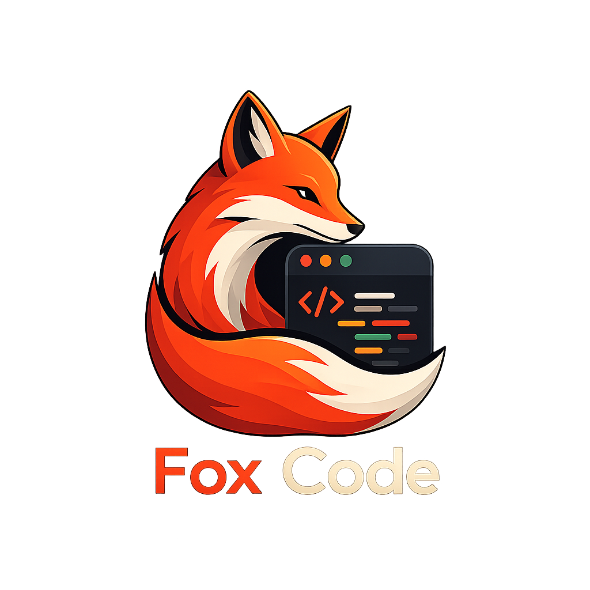

<p align="center">
  
</p>

<p align="center">
  <svg xmlns="http://www.w3.org/2000/svg" width="820" height="310" viewBox="0 0 820 310" style="max-width:100%;">
    <defs>
      <linearGradient id="bgGrad" x1="0%" y1="0%" x2="100%" y2="100%">
        <stop offset="0%" stop-color="#0d0d0f">
          <animate attributeName="stop-color" values="#0d0d0f;#1a0a0f;#0d0d0f" dur="8s" repeatCount="indefinite"/>
        </stop>
        <stop offset="100%" stop-color="#1a0a0f">
          <animate attributeName="stop-color" values="#1a0a0f;#0d0d0f;#1a0a0f" dur="8s" repeatCount="indefinite"/>
        </stop>
      </linearGradient>
      <linearGradient id="accent" x1="0%" y1="0%" x2="100%" y2="0%">
        <stop offset="0%" stop-color="#c0294a"/>
        <stop offset="50%" stop-color="#e8496a">
          <animate attributeName="stop-color" values="#e8496a;#c0294a;#e8496a" dur="4s" repeatCount="indefinite"/>
        </stop>
        <stop offset="100%" stop-color="#c0294a"/>
      </linearGradient>
    </defs>
    <rect width="820" height="310" fill="url(#bgGrad)" rx="18"/>
    <!-- Fox Logo -->
    <g transform="translate(90, 85)">
      <polygon points="5,65 25,0 45,65" fill="none" stroke="#c0294a" stroke-width="3" stroke-linejoin="round">
        <animate attributeName="stroke-opacity" values="1;0.5;1" dur="3s" repeatCount="indefinite"/>
      </polygon>
      <polygon points="55,65 75,0 95,65" fill="none" stroke="#c0294a" stroke-width="3" stroke-linejoin="round">
        <animate attributeName="stroke-opacity" values="1;0.5;1" dur="3s" begin="0.5s" repeatCount="indefinite"/>
      </polygon>
      <polygon points="10,65 50,130 90,65" fill="none" stroke="url(#accent)" stroke-width="3" stroke-linejoin="round"/>
      <circle cx="30" cy="80" r="4" fill="#c0294a">
        <animate attributeName="r" values="4;3;4" dur="2.5s" repeatCount="indefinite"/>
      </circle>
      <circle cx="70" cy="80" r="4" fill="#c0294a">
        <animate attributeName="r" values="4;3;4" dur="2.5s" begin="0.4s" repeatCount="indefinite"/>
      </circle>
      <circle cx="50" cy="102" r="3" fill="#e8496a"/>
      <line x1="50" y1="105" x2="50" y2="115" stroke="#e8496a" stroke-width="2" stroke-linecap="round">
        <animate attributeName="y2" values="115;120;115" dur="3s" repeatCount="indefinite"/>
      </line>
      <!-- Cheek marks -->
      <line x1="25" y1="95" x2="15" y2="100" stroke="#333" stroke-width="1.5" stroke-linecap="round"/>
      <line x1="75" y1="95" x2="85" y2="100" stroke="#333" stroke-width="1.5" stroke-linecap="round"/>
    </g>
    <!-- Title -->
    <text x="210" y="125" font-family="'Courier New', monospace" font-size="52" font-weight="900" fill="#ffffff" letter-spacing="2">
      Fox Code
      <animate attributeName="opacity" values="0;1;1" dur="1.5s" fill="freeze"/>
    </text>
    <!-- Animated underline -->
    <line x1="210" y1="138" x2="420" y2="138" stroke="url(#accent)" stroke-width="2" stroke-linecap="round">
      <animate attributeName="x2" values="210;420" dur="1s" begin="0.5s" fill="freeze"/>
    </line>
    <!-- Tagline -->
    <text x="210" y="175" font-family="'Courier New', monospace" font-size="20" fill="#888888">
      Rápido. Ligero.
      <animate attributeName="opacity" values="0;0;1" dur="2s" begin="0.5s" fill="freeze"/>
    </text>
    <text x="412" y="175" font-family="'Courier New', monospace" font-size="20" fill="url(#accent)" font-weight="bold">
      Para siempre.
      <animate attributeName="opacity" values="0;0;0;1" dur="2.5s" begin="1s" fill="freeze"/>
    </text>
    <!-- Subtitle -->
    <text x="210" y="210" font-family="'Courier New', monospace" font-size="14" fill="#555555">
      Un proyecto para la comunidad · Open Source · 100% gratuito
      <animate attributeName="opacity" values="0;0;0;0;1" dur="3s" begin="1.5s" fill="freeze"/>
    </text>
    <!-- Author -->
    <text x="210" y="240" font-family="'Courier New', monospace" font-size="13" fill="#444444">
      Creado por
    </text>
    <text x="296" y="240" font-family="'Courier New', monospace" font-size="13" fill="#c0294a" font-weight="bold">
      jephMD
      <animate attributeName="opacity" values="0;0;0;0;0;1" dur="3.5s" begin="2s" fill="freeze"/>
    </text>
    <!-- Stars decoration -->
    <circle cx="50" cy="20" r="1.5" fill="#c0294a">
      <animate attributeName="opacity" values="0;1;0" dur="4s" repeatCount="indefinite"/>
    </circle>
    <circle cx="770" cy="40" r="1.5" fill="#c0294a">
      <animate attributeName="opacity" values="0;1;0" dur="3.5s" begin="1s" repeatCount="indefinite"/>
    </circle>
    <circle cx="30" cy="280" r="1.5" fill="#c0294a">
      <animate attributeName="opacity" values="0;1;0" dur="5s" begin="2s" repeatCount="indefinite"/>
    </circle>
    <circle cx="790" cy="270" r="1.5" fill="#c0294a">
      <animate attributeName="opacity" values="0;1;0" dur="4.5s" begin="0.5s" repeatCount="indefinite"/>
    </circle>
  </svg>
</p>

<p align="center">
  <a href="#"></a>
  <a href="#"></a>
  <a href="#"></a>
  <a href="#"></a>
  <a href="#"></a>
</p>

<p align="center">
  <strong>Editor de código de escritorio</strong> · Nativo · Rápido · Framework-zero<br/>
  Construido con <strong>Tauri 2</strong>, <strong>Rust</strong> y <strong>TypeScript</strong> vanilla.
</p>

<br/>

---

##  Para la comunidad

**Fox Code** es un proyecto creado **por y para la comunidad**.

- ✅ **100% gratuito** — siempre lo será, sin letra chica
- ✅ **Open Source** — licenciado bajo GPL v3
- ✅ **Ligero** — 30–50 MB de RAM, arranque en < 2s
- ✅ **Sin Electron** — usa el WebView nativo del sistema
- ✅ **Binario pequeño** — 8–15 MB comprimido
- ✅ **Sin frameworks** — TypeScript vanilla puro

> Creado con cariño por [**jephMD**](https://github.com/jephMD).

<br/>

---

## ⚡ ¿Por qué Fox Code?

El mundo del desarrollo tiene editores increíbles, pero la mayoría viene con el peso de Chromium encima. **Fox Code** no:

| Característica | Fox Code | Editores basados en Electron |
|:---|---:|:---:|
| RAM en reposo | **30–50 MB** | 200–500 MB |
| Inicio | **< 2 segundos** | 5–15 segundos |
| Binario | **8–15 MB** | 150–300 MB |
| Framework | **Ninguno** | React / Vue + runtime |
| WebView | **Nativo (Tauri)** | Chromium empaquetado |

> Todo el poder de un editor moderno, sin el lastre.

<br/>

---

## 🛠 Stack

<p align="center">
  
  &nbsp;&nbsp;&nbsp;
  
  &nbsp;&nbsp;&nbsp;
  
  &nbsp;&nbsp;&nbsp;
  
</p>

### Frontend

| | |
|---|---|
| **Lenguaje** | TypeScript vanilla |
| **Bundler** | Vite |
| **Editor** | Monaco Editor |
| **Terminal** | xterm.js |
| **UI** | DOM nativo (sin frameworks) |

### Backend

| | |
|---|---|
| **Lenguaje** | Rust |
| **Runtime** | Tauri 2 |
| **PTY** | portable-pty |
| **Base de datos** | SQLite |
| **HTTP** | Reqwest |
| **Git** | Git2 |

<br/>

---


## 🏁 Empezar

### Requisitos

- [Rust](https://rustup.rs/)
- [Node.js](https://nodejs.org/) 20+
- [Tauri prerequisites](https://v2.tauri.app/start/prerequisites/)


---

## 📁 Estructura del proyecto

```
fox-code/
├── src/          # Frontend TypeScript
├── src-tauri/    # Backend Rust
├── package.json
├── tsconfig.json
└── vite.config.ts
```

Componentes modulares, escritos como clases TypeScript usando la **API nativa del DOM**.

<br/>


---

## 🎯 Roadmap

### v0.1.0
- [x] Editor core
- [x] Terminal
- [x] IA chat
- [x] Explorador de archivos
- [x] Git status
- [x] Paleta de comandos

### Futuro
- [ ] Integración LSP
- [ ] Sistema de extensiones
- [ ] Edición inline con IA
- [ ] Sincronización de workspace
- [ ] Herramientas de debugging

<br/>

---

## 🤝 Contribuir

¿Te gusta el proyecto? ¡Las contribuciones son bienvenidas!

Mira [`CONTRIBUTING.md`](./CONTRIBUTING.md) para empezar.

**Formas de ayudar:**
- Reportar bugs [abriendo un issue](https://github.com/jephMD/fox-code/issues/new)
- Sugerir features nuevas
- Enviar pull requests
- Compartir el proyecto con la comunidad

<br/>

---

## 📄 Licencia

**Fox Code** está licenciado bajo **GNU General Public License v3.0**.

Esto significa que eres libre de:
- Usarlo para cualquier propósito
- Modificarlo y adaptarlo
- Compartirlo con quien quieras
- Distribuir tus versiones modificadas

Siempre manteniendo el mismo license y atribución al autor original.

Lee el archivo [`LICENSE`](./LICENSE) para más detalles.

<br/>

---

<p align="center">
  <svg xmlns="http://www.w3.org/2000/svg" width="600" height="110" viewBox="0 0 600 110" style="max-width:100%;">
    <defs>
      <linearGradient id="footerGrad" x1="0%" y1="0%" x2="100%" y2="0%">
        <stop offset="0%" stop-color="#0d0d0f">
          <animate attributeName="stop-color" values="#0d0d0f;#1a0a0f;#0d0d0f" dur="6s" repeatCount="indefinite"/>
        </stop>
        <stop offset="100%" stop-color="#1a0a0f">
          <animate attributeName="stop-color" values="#1a0a0f;#0d0d0f;#1a0a0f" dur="6s" begin="3s" repeatCount="indefinite"/>
        </stop>
      </linearGradient>
    </defs>
    <rect width="600" height="110" fill="url(#footerGrad)" rx="12"/>
    <!-- Heart -->
    <text x="300" y="40" font-family="monospace" font-size="14" fill="#666666" text-anchor="middle">
      Hecho con
    </text>
    <text x="380" y="40" font-family="monospace" font-size="16" fill="#c0294a" text-anchor="middle">
      ❤️
      <animate attributeName="font-size" values="16;20;16" dur="1.5s" repeatCount="indefinite"/>
    </text>
    <text x="300" y="65" font-family="monospace" font-size="14" fill="#666666" text-anchor="middle">
      por
    </text>
    <text x="328" y="65" font-family="monospace" font-size="14" fill="#c0294a" font-weight="bold" text-anchor="middle">
      jephMD
    </text>
    <text x="300" y="90" font-family="monospace" font-size="12" fill="#444444" text-anchor="middle">
      Siempre libre · Open Source · GPL v3
    </text>
    <!-- Pulsing dots -->
    <circle cx="60" cy="55" r="2" fill="#c0294a">
      <animate attributeName="r" values="2;4;2" dur="2s" repeatCount="indefinite"/>
      <animate attributeName="opacity" values="0.3;1;0.3" dur="2s" repeatCount="indefinite"/>
    </circle>
    <circle cx="540" cy="55" r="2" fill="#c0294a">
      <animate attributeName="r" values="2;4;2" dur="2s" begin="1s" repeatCount="indefinite"/>
      <animate attributeName="opacity" values="0.3;1;0.3" dur="2s" begin="1s" repeatCount="indefinite"/>
    </circle>
  </svg>
</p>

<p align="center">
  <sub>Construido con Tauri, Rust y TypeScript · <a href="https://github.com/jephMD">@jephMD</a></sub>
</p>
